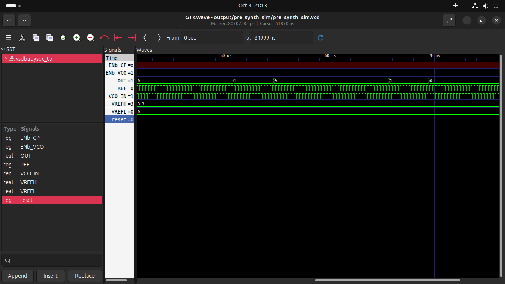
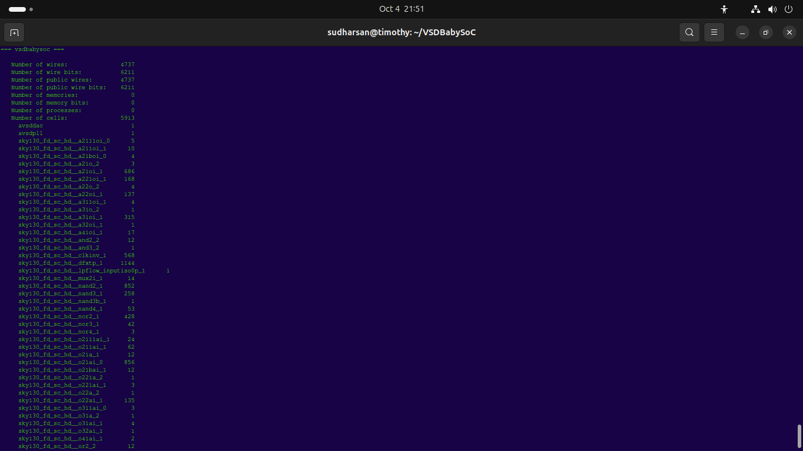
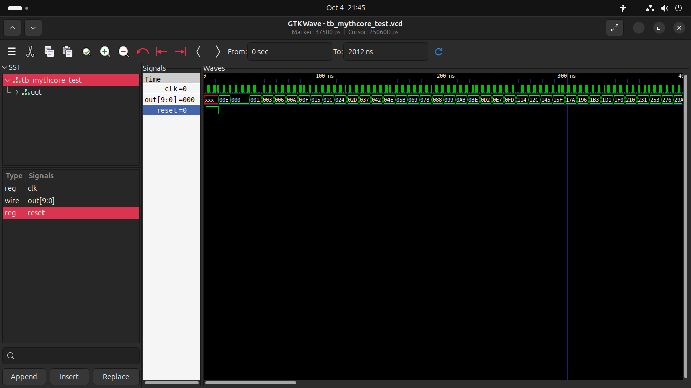

# 🧪 RISC-V & SoC Simulation Analysis Report

> 💡 **Note**: This document was created with the help of @kunalg123 and @ankitmawle sirs guidance along with AI assistants. Thanks for the guidance! 🙏

## 📁 Table of Contents

- [1️⃣ VSDBabySoC — Pre-Synthesis Simulation](#1️⃣-vsdbabysoc-—-pre-synthesis-simulation)
- [2️⃣ VSDBabySoC — Post-Synthesis Simulation](#2️⃣-vsdbabysoc-—-post-synthesis-simulation)
- [3️⃣ RVMythCore — RISC-V Core Simulation](#3️⃣-rvmythcore-—-risc-v-core-simulation)
- [📊 Summary Table](#📊-summary-table)
- [🛠️ How to Fix These Issues](#🛠️-how-to-fix-these-issues)
- [📂 Folder Structure Suggestion](#📂-folder-structure-suggestion)
- [📬 Feedback / Issues?](#📬-feedback--issues)

## 1️⃣ VSDBabySoC — Pre-Synthesis Simulation

### 🖼️ Waveform Screenshot


### 📍 Source
> [https://github.com/manili/VSDBabySoC.git](https://github.com/manili/VSDBabySoC.git)

### 📌 What It Shows
- Simulates a Baby SoC core with PLL/VCO components.
- Monitored signals: `ENb_CP`, `ENb_VCO`, `OUT`, `reset`, `VCO_IN`, `REF`, etc.
- Output `OUT` toggles → suggests oscillator is running.

### ⚠️ Critical Issue
> ❗ **`ENb_CP = x` (unknown value)**  
The charge pump enable signal is uninitialized. This can cause undefined behavior in analog/digital mixed-signal blocks.

### ✅ Other Observations
- `reset = 0` → Not asserted at start (may cause improper initialization).
- `VREFH = 3.3`, `VREFL = 0` → Normal supply rails.

### ✅ Recommendation
- Drive `ENb_CP` explicitly in testbench:
  ```verilog
  ENb_CP = 1'b0;
  ```
- Assert `reset` briefly at time 0:
  ```verilog
  reset = 1;
  #10 reset = 0;
  ```

## 2️⃣ VSDBabySoC — Post-Synthesis Simulation

### 🖼️ Waveform Screenshot




### 📍 Source
> [https://github.com/manili/VSDBabySoC.git](https://github.com/manili/VSDBabySoC.git)

### 📌 What It Shows
- Gate-level simulation after synthesis.
- Core oscillator (`OUT`) still toggles → design functionally preserved.
- Same signals monitored as pre-synthesis.

### ⚠️ Critical Issue
> ❗ **`ENb_CP = x` persists** — still uninitialized after synthesis.  
This can cause functional/timing issues in real hardware.

### ✅ Other Observations
- `ENb_VCO = 1`, `VCO_IN = 1` → VCO enabled and stable.
- `REF = 0` → Reference signal held low — may be intentional.
- `reset = 0` → Deasserted from start — consider asserting briefly.

### ✅ Recommendation
- Drive `ENb_CP` explicitly in testbench.
- Tie off unused inputs in RTL if applicable.
- Re-run synthesis + simulation to verify fix.

## 3️⃣ RVMythCore — RISC-V Core Simulation

### 🖼️ Waveform Screenshot


### 📍 Source
> [https://github.com/kunalg123/rvmyth/](https://github.com/kunalg123/rvmyth/)

### 📌 What It Shows
- Simulates a RISC-V core (`mythcore`) with 10-bit output `out[9:0]`.
- Output shows incrementing hex values: `00E, 000, 001, 003, 006, ...`

### ⚠️ Critical Issue
> ❗ **`clk = 0` forever — No Clock Toggling**  
Without a clock, synchronous logic cannot advance. The core cannot execute instructions.

### ✅ Other Observations
- `reset = 0` → Deasserted from t=0 — may need assertion at start.
- `out[9:0]` changes despite no clock → Suggests combinational logic or debug monitor, not true sequential CPU.

### ✅ Recommendation
- Add clock generator to testbench:
  ```verilog
  initial begin
      clk = 0;
      forever #5 clk = ~clk;
  end
  ```
- Assert `reset` briefly before releasing it.

## 📊 Summary Table

| Project       | Simulation Type | Clock Toggling? | Reset Init? | Critical Bug             | Status     |
|---------------|------------------|------------------|-------------|--------------------------|------------|
| VSDBabySoC    | Pre-Synthesis    | ✅ Yes           | ⚠️ No       | `ENb_CP = x`             | ❌ Needs Fix |
| VSDBabySoC    | Post-Synthesis   | ✅ Yes           | ⚠️ No       | `ENb_CP = x`             | ❌ Needs Fix |
| RVMythCore    | Behavioral       | ❌ No            | ⚠️ No       | `clk = 0` (no clock)     | ❌ Needs Fix |

## 🛠️ How to Fix These Issues

### For VSDBabySoC (Both Pre & Post Synth):

#### ➤ In Testbench (`vsdbabysoc_tb.v`)
```verilog
initial begin
    reset = 1;
    ENb_CP = 1'b0;
    ENb_VCO = 0;
    VCO_IN = 1;
    #10 reset = 0;
    #10 ENb_VCO = 1;
end
```

#### ➤ In RTL (`vsdbabysoc.v`)
If `ENb_CP` is unused, tie it off:
```verilog
assign ENb_CP = 1'b0;
```

### For RVMythCore:

#### ➤ In Testbench (`tb_mythcore_test.v`)
```verilog
initial begin
    clk = 0;
    forever #5 clk = ~clk;
end

initial begin
    reset = 1;
    #10 reset = 0;
end
```


---

Just @kunalg123 sir said at week 0 I took help from the AI assistant platforms in understanding the waveforms and form a relatively right debugged code.

---
